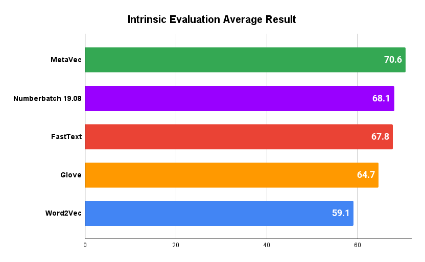

# MetaVec: The Best Word Embeddings To Date
MetaVec is a monolingual and cross-lingual meta-embedding generation framework.  
MetaVec outperforms every previously proposed meta-embedding generation method. Our best-meta embedding achieves the best-published results in a wide range of intrinsic evaluation tasks. 


____

# Download MetaVec

You can download our pre-computed meta-embedding. 
This meta embeddings combines [FastText](https://fasttext.cc/docs/en/english-vectors.html), [Numberbatch](https://github.com/commonsense/conceptnet-numberbatch), [JOINTChyb](http://ixa2.si.ehu.es/ukb/bilingual_embeddings.html) and [Paragram](https://github.com/jwieting/paragram-word).

| Click to Download                                                   | Words     | Dimensions | Size   | Link                                                     |
|---------------------------------------------------------------------|-----------|------------|--------|----------------------------------------------------------|
| [MetaVec](https://adimen.si.ehu.es/~igarcia/embeddings/MetaVec.zip) | 4,573,185 | 300        | 11.8GB | https://adimen.si.ehu.es/~igarcia/embeddings/MetaVec.zip |

### Reduced Vocabulary versions
MetaVec is a very large embedding. We provide reduced vocabulary versions of the Meta-Embedding. The vector representations are the same,
but we include only a subset of the words in the vocabulary.

| Click to Download                                                               | Words     | Dimensions | Size   |                                                                                                                                                   |
|---------------------------------------------------------------------------------|-----------|------------|--------|---------------------------------------------------------------------------------------------------------------------------------------------------|
| [MetaVec 2M]( https://adimen.si.ehu.es/~igarcia/embeddings/MetaVec_2M.zip)      | 1,999,995 | 300        | 4.8GB  | Only words in [crawl-300d-2M.vec](https://fasttext.cc/docs/en/english-vectors.html) (FastText Common Crawl) vocabulary                            |
| [MetaVec 1M](https://adimen.si.ehu.es/~igarcia/embeddings/MetaVec_1M.zip)       | 830,063   | 300        | 2GB    | Only words in  [wiki-news-300d-1M.vec](https://fasttext.cc/docs/en/english-vectors.html)  (FastText Wikipedia) vocabulary                         |
| [MetaVec 0.2M](https://adimen.si.ehu.es/~igarcia/embeddings/MetaVec_200000.zip) | 186,647   | 300        | 0.45GB | Only words in the 200,000 most common English Words List according to the  [Google's Trillion Words Corpus](https://books.google.com/ngrams/info) |

# Citation
```
@inproceedings{garcia-ferrero-etal-2021-benchmarking-meta,
    title = "Benchmarking Meta-embeddings: What Works and What Does Not",
    author = "Garc{\'\i}a-Ferrero, Iker  and
      Agerri, Rodrigo  and
      Rigau, German",
    booktitle = "Findings of the Association for Computational Linguistics: EMNLP 2021",
    month = nov,
    year = "2021",
    address = "Punta Cana, Dominican Republic",
    publisher = "Association for Computational Linguistics",
    url = "https://aclanthology.org/2021.findings-emnlp.333",
    pages = "3957--3972",
```

____
# Usage
## Installation 

### Generate meta-embeddings
If you only want to generate meta-embeddings you need:
- Python 3 (3.7 or greater)
- Numpy
- tqdm
- Cupy, if you have an Nvidia GPU you can install cupy to use the GPU instead of the CPU for faster matrix operations: https://docs.cupy.dev/en/stable/install.html

### Evaluation framework
If you want to run the evaluation framework we have prepared a conda environment file that will install all the required dependencies. 
This file will create a conda environment called "metavec" with the required dependencies to generate meta-embeddings, run the intrinsic and run the extrinsic evaluation framework. 
```
conda env create -f environment.yml
conda activate metavec
```

If you don't want to use conda you can inspect the "environment.yml" file to see the required dependencies and manually install them.

### Get third party requeriments
If you just want to generate meta-embeddings you only need to clone the [VecMap repository](https://github.com/artetxem/vecmap) inside the MetaVec directory. The following command will do that for you:
```
sh get_third_party.sh
```

If you want to generate meta-embedding and evaluate them you need to clone the [Vecmap](https://github.com/artetxem/vecmap), [word embedding benchmarks](https://github.com/kudkudak/word-embeddings-benchmarks) and [Jiant](https://github.com/nyu-mll/jiant-v1-legacy) repositories. For the last two ones, we will download a modified version to run the same configuration used in our paper. The script will also install and download the nltk and spacy required packages for evaluation. To run this command you first need to install the [evaluation framework dependencies](#evaluation-framework).
```
sh get_third_party.sh all
```

## Generate a Meta-Embedding

Here is an example command to generate a meta-embedding using FastText, JointcHYB, paragram and numberbatch as source embeddings.   
- embeddings: Path of the source embeddings you want to combine to generate a meta-embedding
- rotate_to: Path to the embedding to which all source embedding will be aligned using VecMap, it doesn't need to be one of the source embeddings. 
- output_path: Path where the generated meta-embedding will be saved
```
python run_metavec.py \
--embeddings embeddings/crawl-300d-2M.vec embeddings/JOINTC-HYB-ENES.emb embeddings/paragram_ws353.vec embeddings/numberbatch-en.txt \
--rotate_to embeddings/crawl-300d-2M.vec \
--output_path embeddings/MetaVec.vec
```

See [embeddings/README.md](embeddings/README.md) for instructions on how to download the source embeddings that we test in our paper.

## Run the Unified Evaluation Framework

### Intrinsic Evaluation
The intrinsic evaluation uses the Word Embedding Benchmark toolkit: https://github.com/kudkudak/word-embeddings-benchmarks


Evaluate a Word Embedding
```
python instrinsic_evaluation.py -i embeddings/MetaVec.vec
```

Evaluate all the Word Embeddings in a directory

```
python instrinsic_evaluation.py -d embeddings/
```

If you want to set a custom output directory for the evaluation results use the "--output_dir path" argument.

## Extrinsic Evaluation (GLUE)
The extrinsic evaluation uses the Jiant-V1 toolkit: https://github.com/nyu-mll/jiant-v1-legacy

Evaluate a Word Embedding
```
python extrinsic_evaluation.py -i embeddings/MetaVec.vec
```

Evaluate all the Word Embeddings in a directory

```
python extrinsic_evaluation.py -d embeddings/
```

If you want to set a custom output directory for the evaluation results use the "--output_dir path" argument.

